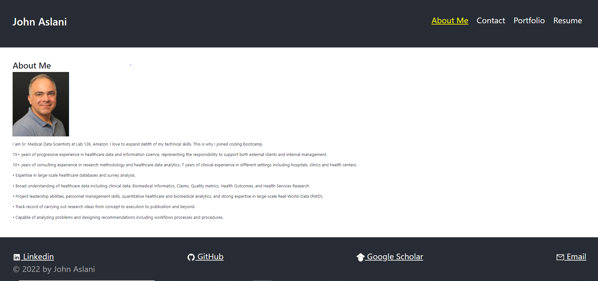

# My Portfolio

## Portfolio is a practice app to create a professional portfolio page

## Contributions

Made by John Aslani

## License: MIT

This program licensed under [MIT](https://img.shields.io/badge/license-MIT-blue)

## Screenshot

## [Link to deployed application](https://johnaslani.github.io/myportfolio/)

## Questions

For further information see [my GitHub](https://github.com/johnaslani) or [Weather-Dashboard](https://github.com/johnaslani/myportfolio)

Should you have any questions, please reach me at [aslani.john@gmail.com](mailto:aslani.john@gmail.com)